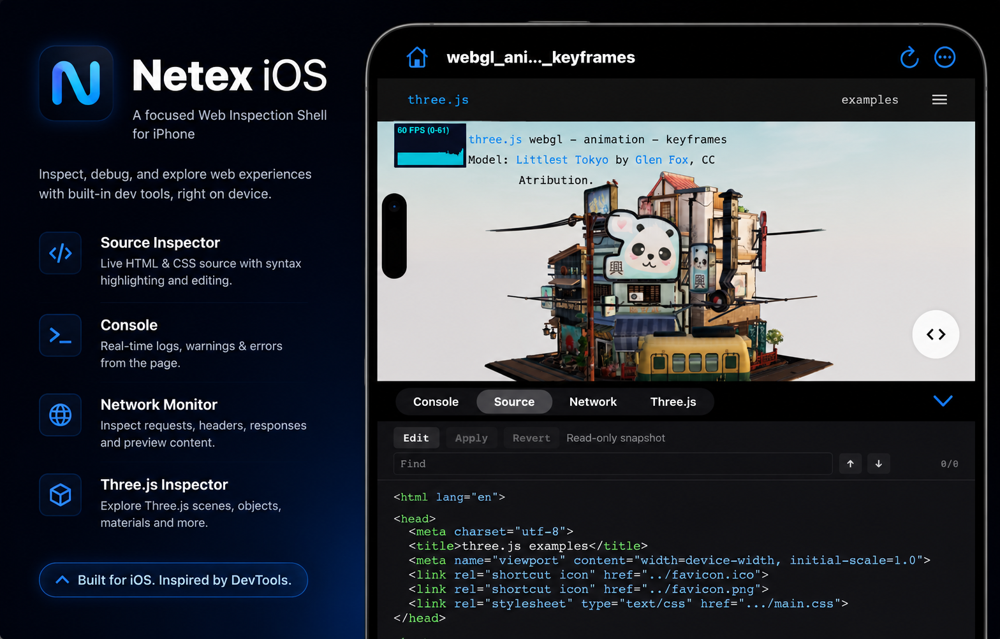
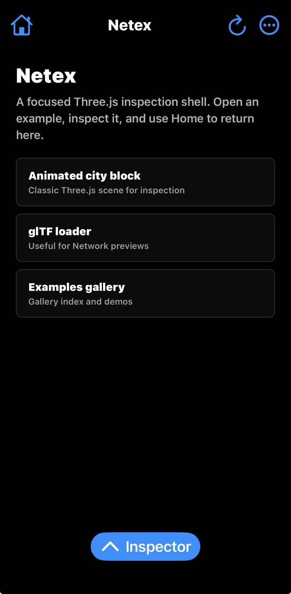
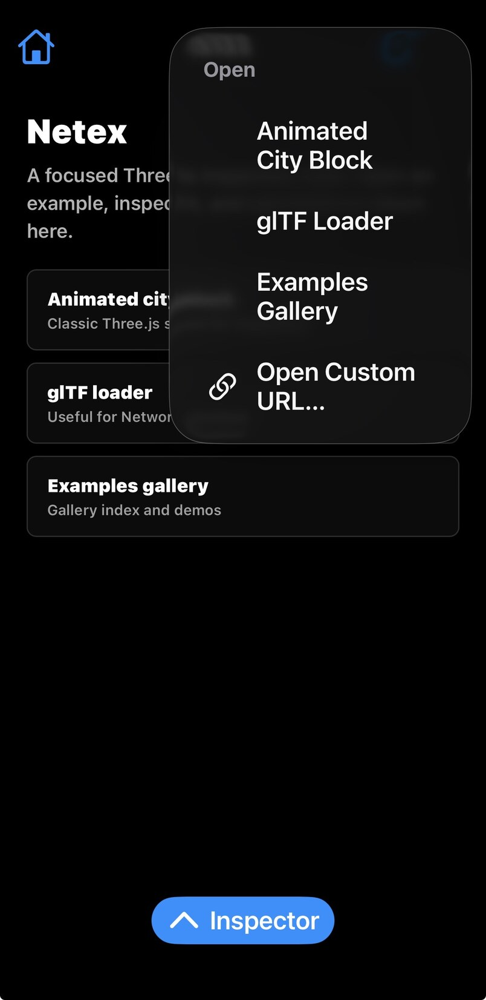
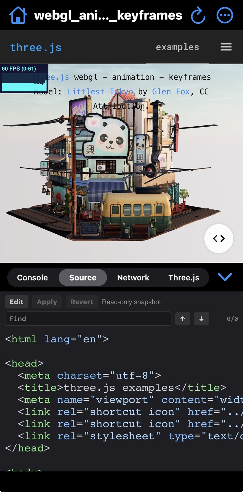
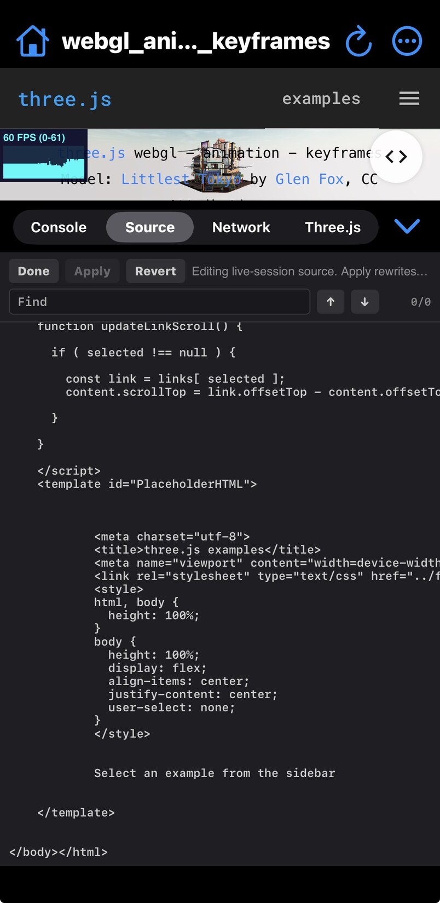
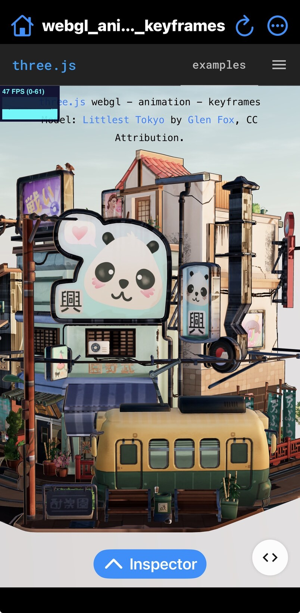

# Netex iOS

Unofficial iOS companion to [Netex](https://github.com/mrdoob/netex), built with Swift and `WKWebView`.

Netex iOS keeps the same core idea on iPhone: a compact web surface with a lower developer panel for Console, Source, Network, and Three.js. The original Android Netex app remains in its own repository; this repo exists so the iOS version can evolve separately.

<p align="center">
  
</p>

## Status

- Local Netex start page instead of a remote default launch URL.
- Focused top chrome with Home, page title, Reload, and an Examples menu led by the classic animated city-block scene.
- Curated Three.js entry points for the examples gallery, animated model, and glTF loader, with custom URL entry kept in the advanced menu.
- Reload control and back/forward swipe gestures through `WKWebView`.
- Console panel with batched injected `console.*` forwarding.
- Source panel using `document.documentElement.outerHTML`, with local lazy-loaded beautifier/highlighter assets. The read-only view is syntax-highlighted; Edit mode uses a visible native text surface on iOS so caret placement and text insertion stay reliable.
- Network panel using injected `fetch` / `XMLHttpRequest` capture, blob preview storage, and a single full-screen lazy model preview that uses `model-viewer`'s native one-finger orbit and two-finger pan.
- Three.js panel backed by vendored `threejs-devtools/` assets and iOS chrome-shim routing.
- Bundle-backed `netex-assets://` scheme for panel, vendor, and Three.js DevTools resources.
- Debug `WKWebView.isInspectable` support on iOS 16.4+.
- Native panel drag snap points and safe-area layout.
- Native signpost/log hooks for launch, navigation, panel readiness, perf marks, first console row, first network row, and Three.js readiness.

## Screenshots

<table>
  <tr>
    <td align="center"></td>
    <td align="center"></td>
    <td align="center"></td>
  </tr>
  <tr>
    <td align="center"><strong>Local start page</strong></td>
    <td align="center"><strong>Curated examples</strong></td>
    <td align="center"><strong>Source Inspector</strong></td>
  </tr>
  <tr>
    <td align="center"></td>
    <td align="center"></td>
    <td align="center"></td>
  </tr>
  <tr>
    <td align="center"><strong>Expanded editor</strong></td>
    <td align="center"><strong>Full-screen example</strong></td>
    <td align="center"></td>
  </tr>
</table>

## Requirements

- Xcode with an iOS 17+ simulator runtime.
- [XcodeGen](https://github.com/yonaskolb/XcodeGen).

## Build And Test

```sh
xcodegen generate
xcodebuild test -project NetexIOS.xcodeproj -scheme NetexIOS -destination 'platform=iOS Simulator,name=iPhone 17 Pro' CODE_SIGNING_ALLOWED=NO
```

The test suite covers URL/search resolution, bundle asset loading, shim mode parsing, bridge envelope decoding, console/network batching, blob FIFO eviction, extension port replay, and UI smoke tests for the local start page, examples menu, hidden custom URL flow, inspector hide/show, and all panel tabs.

To install and launch the simulator build manually:

```sh
xcodegen generate
xcodebuild build -project NetexIOS.xcodeproj -scheme NetexIOS -destination 'platform=iOS Simulator,name=iPhone 17 Pro' CODE_SIGNING_ALLOWED=NO
xcrun simctl install booted ~/Library/Developer/Xcode/DerivedData/NetexIOS-*/Build/Products/Debug-iphonesimulator/NetexIOS.app
xcrun simctl launch booted io.github.hard2forgetme.netexios
```

## Debug Modes

Set `NETEX_SHIMS` in the scheme environment to narrow startup and bridge timing:

```sh
NETEX_SHIMS=off       # no injected shims
NETEX_SHIMS=console   # console bridge only
NETEX_SHIMS=network   # network bridge only
NETEX_SHIMS=full      # default full bridge and Three.js shims
```

Use this for A/B profiling when a page feels slow. In debug builds, iOS Web Inspector can also attach to the page and panel web views.

## Profiling

- Use Instruments or `os_signpost` views around the `io.github.hard2forgetme.netexios` subsystem.
- Key signpost names include `app-view-did-load`, `navigation-start`, `wk-did-start`, `wk-did-finish`, `panel-ready`, `three-panel-ready`, `three-page-ready`, `first-console-row`, and `first-network-row`.
- The JS performance shim forwards browser `performance.mark` events into the same native log lane.
- The local start page should appear quickly because no CDN or remote Three.js example is loaded at app launch.

For a repeatable simulator receipt:

```sh
NETEX_PROFILE_RUN_TESTS=1 Scripts/profile_netex_ios.sh
```

The script records branch, commit, Xcode version, destination, build time, optional test time, launch output, screenshot, and native log paths under `artifacts/` by default. Use `NETEX_SIM_ID`, `NETEX_DESTINATION`, and `NETEX_PROFILE_DIR` to override the simulator and output location.

To launch the local stress harness manually:

```sh
xcrun simctl launch booted io.github.hard2forgetme.netexios --netex-reset --netex-url netex-assets://bundle/NetexAssets/stress.html
```

## Install On A Paired iPhone

For a local development install, pass your own Apple development team and a bundle id that belongs to that team:

```sh
DEVELOPMENT_TEAM=<TEAM_ID> \
PRODUCT_BUNDLE_IDENTIFIER=<YOUR_BUNDLE_ID> \
DEVICE_UDID=<DEVICE_UDID> \
COREDEVICE_ID=<COREDEVICE_ID> \
Scripts/build_device.sh
```

Use `xcodebuild -showdestinations -project NetexIOS.xcodeproj -scheme NetexIOS` for the Xcode device UDID and `xcrun devicectl list devices` for the CoreDevice install/launch id. The helper keeps committed signing defaults neutral, builds with command-line signing overrides, strips macOS bundle metadata if codesign rejects it, verifies the signed app, installs when `COREDEVICE_ID` is set, and writes receipts under `artifacts/`. Do not commit personal team IDs, provisioning profiles, or local bundle IDs.

## Third-Party Notices

The iOS target bundles local inspector assets to avoid first-run CDN fetches. See `THIRD_PARTY_NOTICES.md` for bundled dependency sources, versions checked, and license notes.

## Known Deltas

- Physical-device performance depends on local Apple development provisioning; use `Scripts/build_device.sh` for local install receipts.
- The Three.js tab uses the vendored extension panel and shim routing. Treat changes under `Resources/NetexAssets/threejs-devtools/` as vendored unless an upstream Three.js DevTools fix is intentionally being made.

## License

Netex iOS is MIT licensed. The original Netex license notice is preserved in `LICENSE`.
